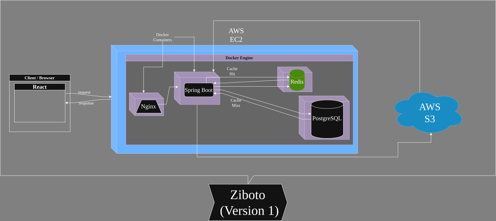

<div align="center">

# 🚀 Ziboto

### A Production-Grade Cloud-Native Distributed Object Storage Platform

**Store • Sync • Share • Secure • Scale**

[](LICENSE)
[](https://spring.io/projects/spring-boot)
[](https://www.docker.com/)
[](https://aws.amazon.com/)

[Features](#-features) • [Architecture](#-architecture) • [Quick Start](#-quick-start) • [Full Spec](#-full-platform-spec) • [Roadmap](#️-roadmap)

</div>

---

## 📖 Overview

**Ziboto** is a cloud-native distributed object storage platform inspired by modern storage systems such as Google Drive, Dropbox, OneDrive, and Amazon S3. It's built to demonstrate enterprise-grade backend engineering, cloud architecture, distributed systems principles, DevOps practices, and scalable infrastructure — not just another CRUD file-upload app.

Files are stored in object storage, metadata is managed separately, caching accelerates performance, asynchronous processing handles background tasks, and the whole thing deploys on modern cloud-native infrastructure.

This README covers **v1** (the current build target — see [Quick Start](#-quick-start) and the staged [Roadmap](#️-roadmap)) and the **[full long-term platform spec](#-full-platform-spec)**, kept here so the complete vision doesn't get lost between sessions.

### Why Ziboto?

- **Production-Ready Architecture** – built for scalability and reliability, not just a demo
- **Cloud-Native Design** – AWS-first, containerized, designed to grow into Kubernetes/Terraform
- **Modern Tech Stack** – Spring Boot, React, PostgreSQL, Redis, RabbitMQ, AWS S3
- **Interview-Ready** – every technology is justified by a real problem in the storage domain, giving genuine discussion points for backend, cloud, DevOps, and system design interviews

---

## ✨ Features (v1 target)

<table>
<tr>
<td width="50%">

### 🔐 Security & Authentication
- JWT-based user authentication
- Role-based access control (planned)
- Secure file access management

### 📁 File Management
- Hierarchical folder structure
- Multi-file upload support
- Fast download with streaming
- Metadata tracking and search

</td>
<td width="50%">

### ⚡ Performance & Scale
- Redis-based intelligent caching
- PostgreSQL for reliable persistence
- AWS S3 for scalable object storage
- Optimized query performance

### 🐳 DevOps Ready
- Fully containerized with Docker
- Docker Compose orchestration
- Nginx reverse proxy
- AWS EC2 cloud deployment

</td>
</tr>
</table>

---

## 🏗️ Architecture

<div align="center">
  

  *High-Level Architecture: Cloud-native design with microservices-ready structure*
</div>

### Architecture Highlights (v1)

- **Frontend Layer**: React SPA with optimistic UI updates via React Query
- **API Gateway**: Nginx reverse proxy for load balancing and SSL termination
- **Application Layer**: Spring Boot REST APIs with JWT authentication
- **Cache Layer**: Redis for session management and frequently accessed data
- **Persistence Layer**: PostgreSQL for metadata and relational data
- **Storage Layer**: AWS S3 for scalable object storage

---

## 🛠️ Technology Stack (v1)

<div align="center">

| Layer | Technologies |
|-------|-------------|
| **Frontend** | React • React Query • Axios • Modern UI |
| **Backend** | Spring Boot 3.x • Spring Security • Spring Data JPA • RESTful APIs |
| **Database** | PostgreSQL 15+ • Redis 7+ |
| **Cloud** | AWS EC2 • AWS S3 • AWS VPC |
| **DevOps** | Docker • Docker Compose • Nginx • Git |

</div>

---

## 📂 Project Structure

```text
ziboto/
│
├── architecture/          # System architecture diagrams and docs
│   └── hld-v1.svg
│
├── backend/              # Spring Boot application
│   ├── src/
│   └── pom.xml
│
├── frontend/             # React application
│   ├── src/
│   └── package.json
│
├── docker/               # Docker configurations
│   ├── backend.Dockerfile
│   ├── frontend.Dockerfile
│   └── nginx.conf
│
├── docker-compose.yml    # Multi-container orchestration
└── README.md            # This file
```

---

## 🚀 Quick Start

### Prerequisites

- Docker Engine 20.10+
- Docker Compose 2.0+
- Git

### Installation

1️⃣ **Clone the repository**

```bash
git clone https://github.com/yourusername/ziboto.git
cd ziboto
```

2️⃣ **Configure environment variables**

```bash
# Create .env file with your AWS credentials
cp .env.example .env
# Edit .env with your configuration
```

3️⃣ **Launch the application**

```bash
docker compose up --build
```

4️⃣ **Access Ziboto**

- **Frontend**: http://localhost
- **Backend API**: http://localhost/api
- **API Docs**: http://localhost/api/swagger-ui.html

### Development Mode

```bash
# Start backend only
docker compose up backend postgres redis

# Start frontend in dev mode (in another terminal)
cd frontend && npm run dev
```

---

## 🗺️ Roadmap

Ziboto grows in three deliberate stages — each with its own theme, so infrastructure changes (v1 → v3) aren't mixed in with feature growth (v1 → v2).

### 🎯 v1 — MVP (Current Sprint)

**Theme: core storage app, simple single-instance deployment**

- [x] Project architecture and setup
- [ ] User authentication & JWT integration
- [ ] Folder hierarchy management
- [ ] File upload with chunking
- [ ] File download with streaming
- [ ] AWS S3 integration
- [ ] Redis caching layer
- [ ] Docker multi-container deployment (single EC2 instance)
- [ ] Nginx reverse proxy configuration

### 🧩 v2 — Feature-Complete

**Theme: same deployment model as v1, but the platform's feature set matures**

- [ ] Role-based access control (RBAC)
- [ ] File sharing with expirable / password-protected links
- [ ] File versioning and history
- [ ] Search system (name, type, size, tags, date)
- [ ] Duplicate detection (SHA-256)
- [ ] RabbitMQ background processing (thumbnails, virus scan, email)
- [ ] Notifications (upload complete, share accepted, login alerts)
- [ ] Comprehensive audit logging
- [ ] Email verification workflow & Google OAuth
- [ ] Full-text search with Elasticsearch

### ☁️ v3 — Cloud-Native Maturity

**Theme: replace the deployment layer entirely — this is an infra rewrite, not a feature add**

- [ ] Migrate from single EC2 + Nginx to Kubernetes (Amazon EKS)
- [ ] Replace plain Nginx with Kubernetes Ingress / AWS Application Load Balancer
- [ ] Terraform for full Infrastructure as Code (VPC, EKS, S3, IAM, networking)
- [ ] Horizontal Pod Autoscaler, rolling updates, Helm charts
- [ ] Prometheus + Grafana dashboards, OpenTelemetry distributed tracing
- [ ] Resilience4j circuit breakers, Bucket4j rate limiting
- [ ] CI/CD pipeline with GitHub Actions
- [ ] Load testing with k6

### 💡 Ideas for Contribution

- Real-time collaboration features
- Mobile app (React Native)
- File preview for common formats
- Automatic virus scanning
- Multi-region replication

---

## 📘 Full Platform Spec

> This is the long-term vision for Ziboto beyond v1 — kept in full here for reference so nothing gets lost between sessions.

### Goals

* Build a production-grade storage platform
* Demonstrate cloud-native architecture
* Learn distributed systems concepts
* Showcase backend engineering skills
* Deploy on AWS using modern DevOps practices
* Implement scalable and secure file storage
* Demonstrate Infrastructure as Code
* Showcase Kubernetes and cloud deployments

### Core Modules

**Authentication & Security**
User Registration • Secure Login • JWT Authentication • Refresh Tokens • Email Verification • Forgot Password • Password Reset • Google OAuth • BCrypt Password Hashing • Role-Based Access Control (RBAC) • Session Management • Device Login Tracking

**User Management**
User Profile • Avatar Upload • Storage Usage Dashboard • Account Settings • Activity History • Storage Quotas • Admin User Management

**File Management**
Upload/Download/Delete/Rename/Copy/Move Files • Bulk Upload • Bulk Delete • Drag & Drop Upload • Folder Creation • Nested Folder Hierarchy • File Preview • Trash Bin • Permanent Delete • Restore Deleted Files

**Smart Upload Engine**
Multipart Uploads • Chunked Uploads • Parallel Uploads • Resumable Uploads • Upload Progress Tracking • Retry Failed Chunks • Upload Validation • Maximum File Size Limits

**Smart Download Engine**
Streaming Downloads • HTTP Range Requests • Download Resume • Secure Temporary Download Links • Download Analytics

**Object Storage**
Files in AWS S3, metadata in PostgreSQL — separation of metadata and file objects for better scalability, lower database size, faster querying, industry-standard architecture.

**Metadata Management**
File Name • File Size • MIME Type • Upload Time • Last Modified • Owner • Folder • SHA-256 Hash • S3 Object Key • File Version • Download Count

**Search System**
Search by Name / Type / Extension / Size / Tags / Date • Filter • Sorting

**File Sharing**
Public/Private Share Links • Password Protected Links • Expiring Links • View/Download/Edit Permission • Share Revocation

**File Versioning**
Version History • Restore Previous Version • Compare Versions • Delete Old Versions

**Storage Intelligence**
Duplicate File Detection • SHA-256 Hashing • Storage Analytics • Usage Statistics • File Type Distribution • Largest Files • Recently Uploaded Files

**Notifications**
Upload Completed • File Shared • Storage Limit Warning • Login Alerts • Security Alerts • Share Accepted

**Audit System**
Every important action is recorded: Login • Logout • Upload • Download • Delete • Rename • Share • Permission Changes • Password Changes

### Backend Architecture (full platform)

```
Client → Nginx Reverse Proxy → Spring Boot API → Redis Cache → PostgreSQL → AWS S3
```

### Backend Technologies

Java 21 • Spring Boot • Spring Security • Spring Data JPA • Spring Validation • Spring Cache • Spring Actuator • Spring Scheduling • Spring Web • MapStruct • Lombok

### Database (PostgreSQL) stores

Users • Metadata • Folder Structure • Sharing Information • Permissions • File Versions • Audit Logs • Notifications

### Cache Layer (Redis) used for

Frequently Accessed Metadata • User Sessions • Download Statistics • Search Results • Authentication Data • Rate Limiting • Frequently Downloaded Files

### Background Processing (RabbitMQ)

Virus Scanning • Thumbnail Generation • Metadata Extraction • Email Notifications • Cache Refresh • Audit Processing • Storage Analytics

### AWS Services

- **Compute**: Amazon EC2
- **Storage**: Amazon S3
- **Identity**: AWS IAM (least-privilege roles for EC2/app access to S3)
- **Networking**: Amazon VPC, Public/Private Subnets, Security Groups, Internet Gateway, NAT Gateway
- **Load Balancing**: AWS Application Load Balancer
- **Monitoring**: CloudWatch, CloudWatch Logs
- **Security**: AWS KMS (optional), AWS Secrets Manager (optional)

### Docker

Every component containerized: Frontend • Backend • PostgreSQL • Redis • RabbitMQ • Nginx

### Kubernetes (Amazon EKS)

Deployments • Services • Ingress • ConfigMaps • Secrets • Persistent Volumes • Horizontal Pod Autoscaler • Rolling Updates

### Terraform (Infrastructure as Code) provisions

VPC • EC2 • EKS Cluster • S3 Bucket • IAM Roles • Security Groups • Load Balancer • CloudWatch Resources • Networking Components

### DevOps

Docker • Docker Compose • GitHub Actions • Automated Build/Testing/Deployment • Docker Registry • Environment Variables • Production Deployment

### Monitoring & Observability

- **Monitoring**: Spring Boot Actuator, Prometheus, Grafana
- **Distributed Tracing**: OpenTelemetry
- **Metrics**: API Response Time • Cache Hit Ratio • Upload/Download Time • Active Users • Memory/CPU Usage • S3 Latency • Database Query Performance

### Security (full platform)

JWT Authentication • Refresh Tokens • BCrypt Password Hashing • Role-Based Access Control • OAuth2 Login • Input Validation • Secure HTTP Headers • CORS Configuration • HTTPS • Rate Limiting (Bucket4j + Redis) • File Type/Size Validation • Secure Download Tokens

### Scalability Features

Stateless Backend APIs • Redis Distributed Cache • Horizontal Scaling • Load Balancing • Object Storage Separation • Background Processing • Connection Pooling • Retry Mechanisms • Health Checks • Circuit Breaker (Resilience4j)

### Testing

- **Unit**: JUnit 5, Mockito
- **Integration**: Spring Boot Test, Testcontainers
- **API**: Postman Collection
- **Load**: k6

### Full Tech Stack

**Frontend**: React 19 • TypeScript • Tailwind CSS • React Query • React Router • Axios
**Backend**: Java 21 • Spring Boot • Spring Security • Spring Data JPA • MapStruct • Spring Actuator
**Database**: PostgreSQL
**Cache**: Redis
**Messaging**: RabbitMQ
**Cloud**: AWS EC2 • AWS S3 • AWS IAM • AWS VPC • AWS Application Load Balancer • CloudWatch
**Infrastructure**: Docker • Docker Compose • Kubernetes (Amazon EKS) • Terraform
**DevOps**: GitHub Actions • CI/CD
**Monitoring**: Prometheus • Grafana • OpenTelemetry

---

## 🔮 Beyond v3 (Future Enhancements)

**Theme: intelligence and multi-tenancy — not required for a working platform, but natural next steps once v1–v3 are solid**

### AI

Smart File Search • Natural Language Search • Automatic File Categorization • Duplicate Detection Suggestions • AI File Summaries

### Enterprise

Team Workspaces • Organization Management • Storage Quotas • Admin Dashboard • Billing Integration • Multi-Tenant Support • Compliance Reports

---

## 🤝 Contributing

1. Fork the repo and branch from `main`:
   ```bash
   git checkout -b feature/amazing-feature
   ```
2. Commit with [Conventional Commits](https://www.conventionalcommits.org/):
   ```bash
   git commit -m "feat: add amazing new feature"
   ```
3. Push and open a Pull Request.

**Guidelines**: follow existing code style • write clear commit messages • add tests for new features • update docs • keep PRs focused and atomic.

---

## 🐛 Issues & Support

- **Bug Reports**: [Open an issue](https://github.com/yourusername/ziboto/issues/new?template=bug_report.md)
- **Feature Requests**: [Request a feature](https://github.com/yourusername/ziboto/issues/new?template=feature_request.md)
- **Questions**: Check existing [discussions](https://github.com/yourusername/ziboto/discussions) or start a new one

---

## 📄 License

MIT License — see [LICENSE](LICENSE) for details.

---

## 🙏 Acknowledgments

Built with [Spring Boot](https://spring.io/projects/spring-boot) • [React](https://react.dev/) • [PostgreSQL](https://www.postgresql.org/) • [Redis](https://redis.io/) • [Docker](https://www.docker.com/) • [AWS](https://aws.amazon.com/)

---

<div align="center">

**⭐ Star this repo if you find it helpful!**

Made with ❤️ by the Ziboto team

[Report Bug](https://github.com/yourusername/ziboto/issues) • [Request Feature](https://github.com/yourusername/ziboto/issues) • [Documentation](https://github.com/yourusername/ziboto/wiki)

</div>
