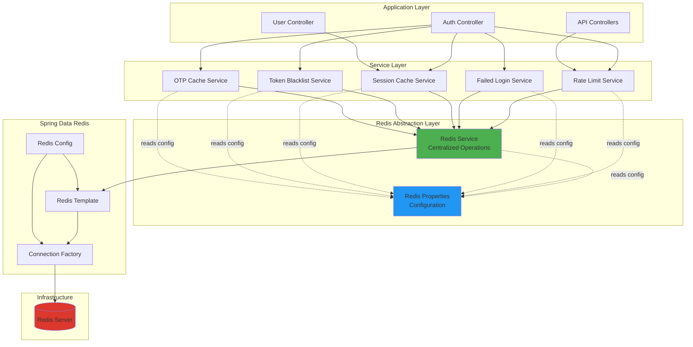
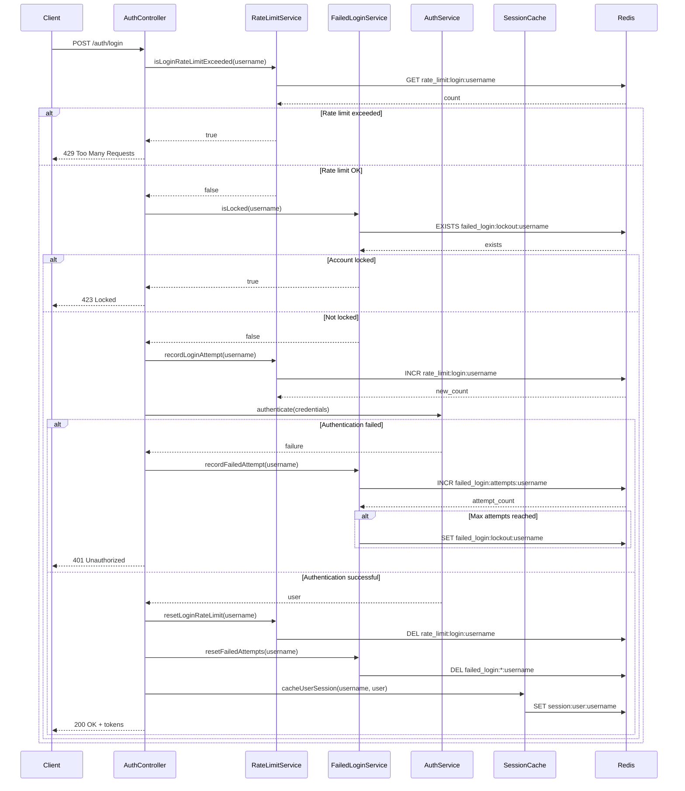
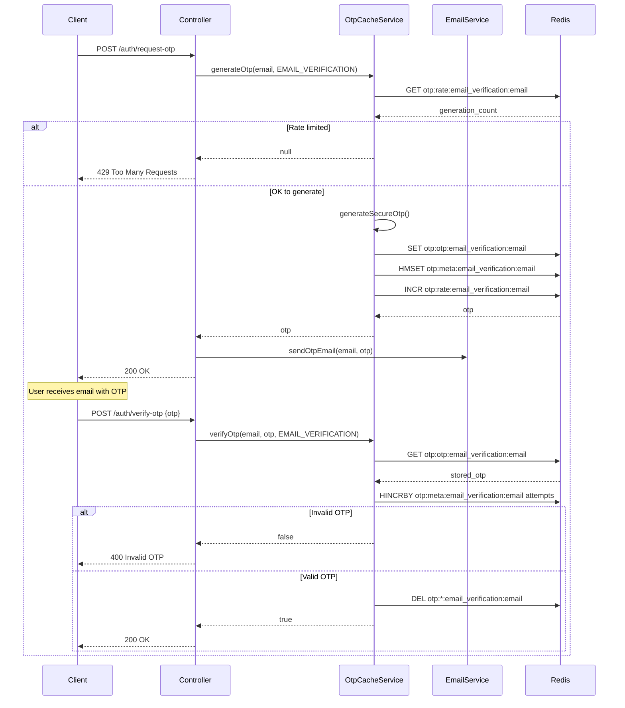
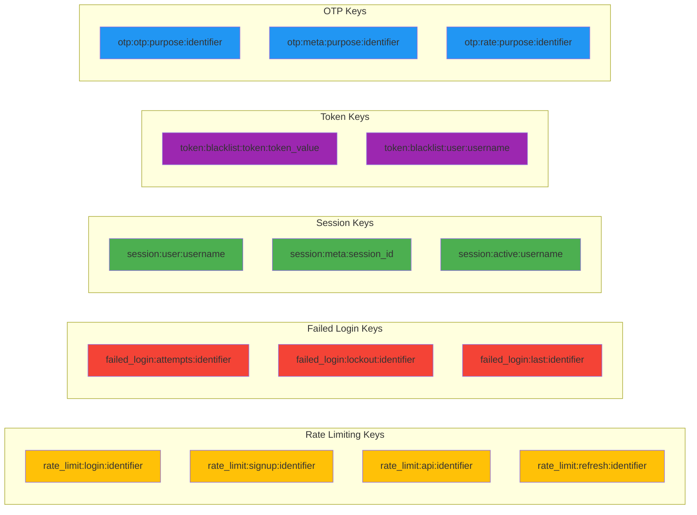
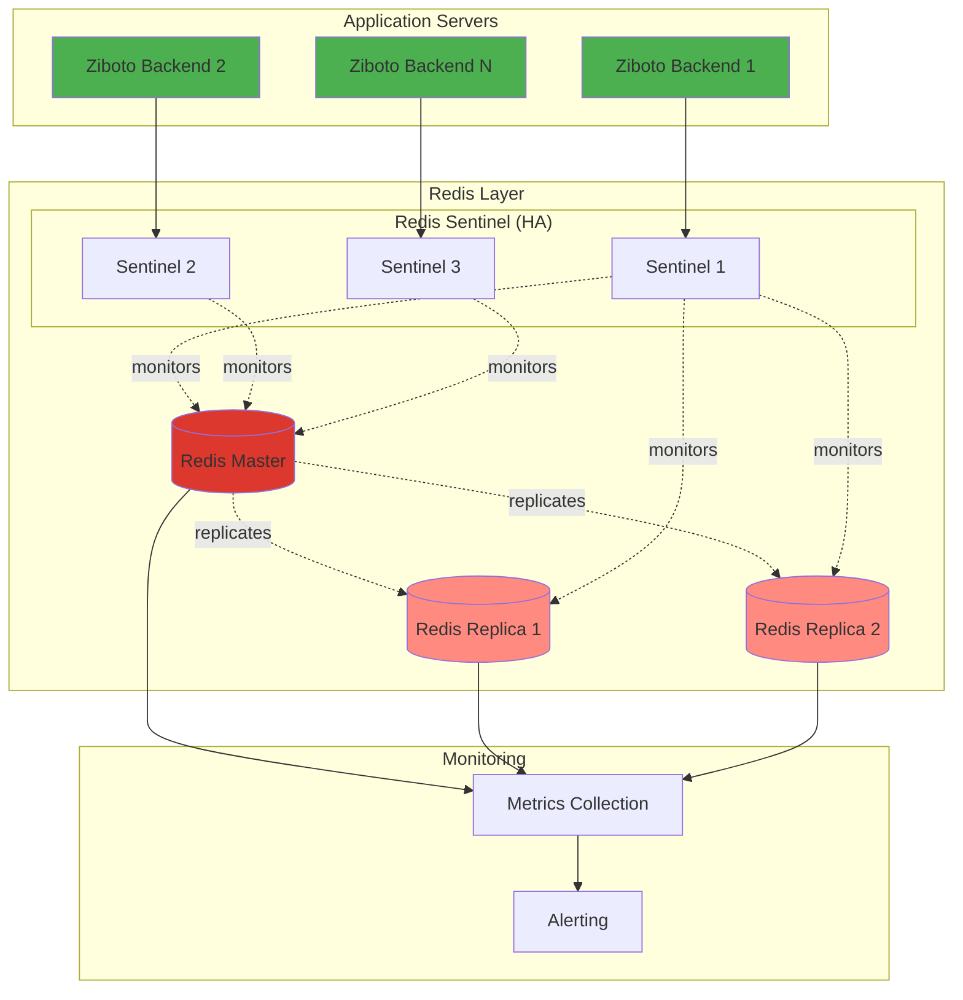
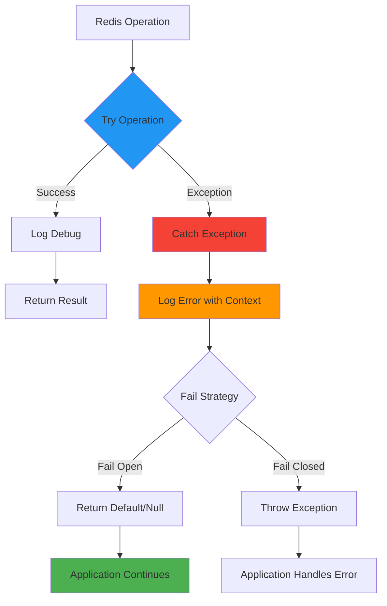
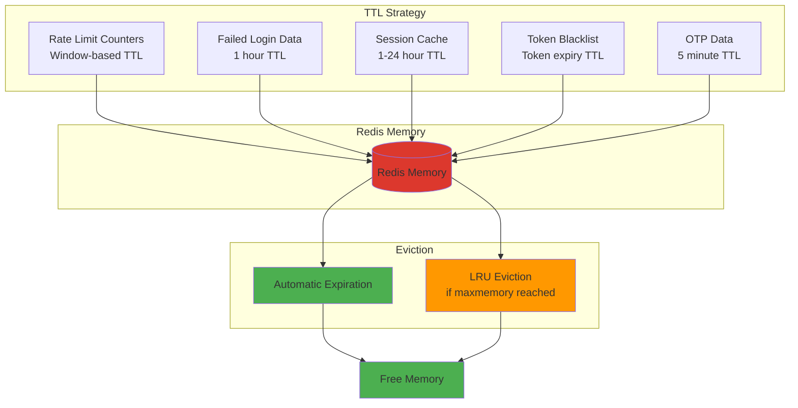

# Redis Architecture Diagram

## System Overview



## Data Flow

### Login Flow with Rate Limiting and Failed Attempt Tracking



### OTP Verification Flow



## Redis Key Structure



## Configuration Flow

```mermaid
graph TD
    ENV[Environment Variables<br/>.env file] --> YML[application.yml]
    YML --> RP[RedisProperties<br/>@ConfigurationProperties]
    
    RP --> RLS[RateLimitService]
    RP --> FLS[FailedLoginService]
    RP --> SCS[SessionCacheService]
    RP --> TBS[TokenBlacklistService]
    RP --> OCS[OtpCacheService]
    
    RLS --> RS[RedisService]
    FLS --> RS
    SCS --> RS
    TBS --> RS
    OCS --> RS
    
    RS --> RT[RedisTemplate]
    RT --> REDIS[(Redis)]
    
    style ENV fill:#FFE082
    style RP fill:#2196F3
    style RS fill:#4CAF50
    style REDIS fill:#DC382D
```

## Service Responsibilities

```mermaid
graph TB
    subgraph "Rate Limiting"
        R1[Login Rate Limit]
        R2[Signup Rate Limit]
        R3[API Rate Limit]
        R4[Token Refresh Rate Limit]
    end
    
    subgraph "Security"
        S1[Failed Login Tracking]
        S2[Account Lockout]
        S3[Token Blacklisting]
        S4[OTP Generation & Verification]
    end
    
    subgraph "Performance"
        P1[User Session Cache]
        P2[Session Metadata]
        P3[Active Session Tracking]
    end
    
    subgraph "Core Operations"
        C1[Set/Get with TTL]
        C2[Increment/Decrement]
        C3[Hash Operations]
        C4[Set Operations]
    end
    
    R1 --> C2
    R2 --> C2
    R3 --> C2
    R4 --> C2
    
    S1 --> C2
    S2 --> C1
    S3 --> C1
    S4 --> C1
    S4 --> C3
    
    P1 --> C1
    P2 --> C3
    P3 --> C3
    
    style R1 fill:#FFC107
    style R2 fill:#FFC107
    style R3 fill:#FFC107
    style R4 fill:#FFC107
    style S1 fill:#F44336
    style S2 fill:#F44336
    style S3 fill:#9C27B0
    style S4 fill:#2196F3
    style P1 fill:#4CAF50
    style P2 fill:#4CAF50
    style P3 fill:#4CAF50
```



## Deployment Architecture



## Error Handling Flow



## Memory Management



## Summary

This architecture provides:

1. **Separation of Concerns:** Each service has a specific responsibility
2. **Centralized Operations:** All Redis operations through RedisService
3. **Centralized Configuration:** All settings in RedisProperties
4. **High Availability:** Support for Redis Sentinel/Cluster
5. **Fail-Safe:** Graceful degradation on Redis failures
6. **Performance:** Efficient caching and rate limiting
7. **Security:** Token blacklisting, rate limiting, account lockout
8. **Scalability:** Horizontal scaling support
9. **Monitoring:** Built-in metrics and logging
10. **Maintainability:** Clean, documented, testable code
