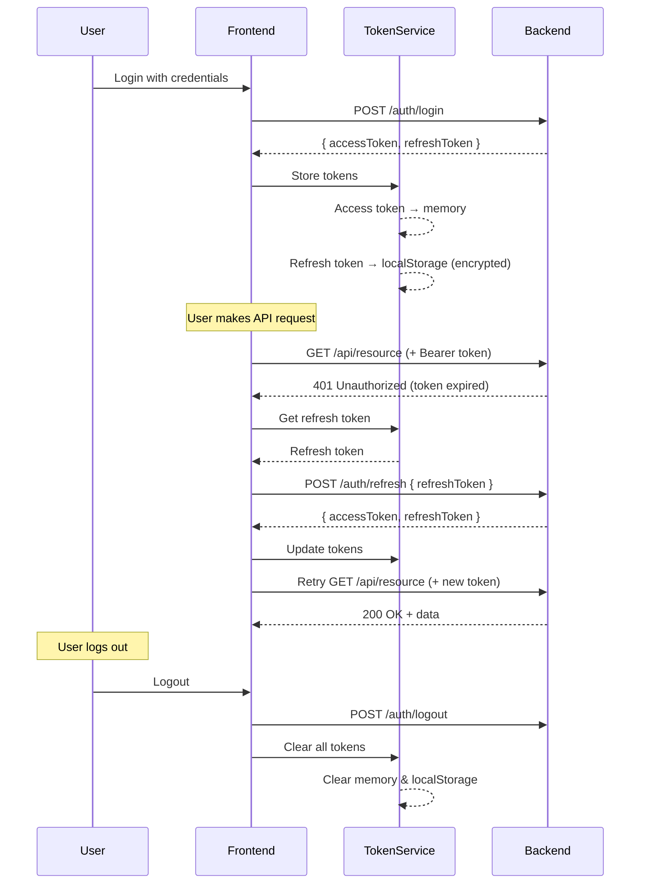

# JWT Authentication Implementation

This document describes the JWT (JSON Web Token) authentication implementation for the Ziboto frontend application.

## Overview

The authentication system is designed to work seamlessly with Spring Security JWT authentication on the backend. It provides secure token management, automatic token refresh, and comprehensive error handling.

## Architecture

### Token Storage Strategy

The implementation uses a dual-storage approach for maximum security:

1. **Access Token**: Stored in **memory only** (cleared on page refresh)
   - More secure as it's not persisted in browser storage
   - Automatically attached to every API request
   - Short-lived (typically 15-30 minutes)

2. **Refresh Token**: Stored in **localStorage with encryption**
   - Encrypted using basic obfuscation (reversible base64 encoding)
   - Persists across page reloads
   - Long-lived (typically 7-30 days)
   - Used to obtain new access tokens

> **Note**: For maximum security in production, refresh tokens should be stored in **httpOnly cookies** managed by the backend. The current implementation uses localStorage as a fallback when httpOnly cookies aren't available.

## Features

### ✅ Core Features Implemented

1. **Automatic Token Attachment**
   - JWT access token automatically attached to every API request via axios interceptor
   - Uses `Authorization: Bearer <token>` header

2. **Automatic Token Refresh**
   - Expired access tokens are automatically refreshed using the refresh token
   - Failed requests are automatically retried after successful token refresh
   - Concurrent requests are queued during token refresh to prevent race conditions

3. **Session Restoration**
   - On page refresh, if access token is missing but refresh token exists, the session is automatically restored
   - Users remain logged in across page reloads

4. **Proactive Token Refresh**
   - Access tokens are proactively refreshed before expiry (2 minutes before or at half-life)
   - Prevents unnecessary 401 errors during active sessions

5. **Session Expiry Handling**
   - Automatic logout when refresh token expires
   - Redirect to login page with appropriate message
   - Session checks every minute to detect expired tokens

6. **Multi-Tab Synchronization**
   - Logout in one tab triggers logout in all other tabs
   - Uses localStorage events for cross-tab communication

7. **Error Handling**
   - Comprehensive error handling for authentication failures
   - Prevents infinite refresh loops
   - Clear error messages for different failure scenarios

## Key Files

### 1. Token Service (`src/services/tokenService.ts`)

Manages token storage, retrieval, and validation.

**Key Methods:**
- `getAccessToken()`: Retrieves access token from memory
- `getRefreshToken()`: Retrieves encrypted refresh token from localStorage
- `setTokens(access, refresh)`: Stores both tokens securely
- `setAccessToken(access)`: Updates only the access token (used during refresh)
- `clearTokens()`: Removes all tokens (logout)
- `isTokenExpired()`: Checks if access token is expired (1-minute buffer)
- `isTokenExpiringSoon()`: Checks if token expires within 5 minutes
- `hasValidTokens()`: Validates both tokens exist and are not expired
- `decodeToken(token)`: Decodes JWT payload (doesn't validate signature)

### 2. Axios Instance (`src/lib/axios.ts`)

Configured axios instance with interceptors for JWT handling.

**Request Interceptor:**
- Automatically attaches access token to every request
- Adds `Authorization: Bearer <token>` header

**Response Interceptor:**
- Intercepts 401 (Unauthorized) responses
- Attempts to refresh access token using refresh token
- Retries failed requests with new token
- Queues concurrent requests during refresh
- Prevents refresh loops on auth endpoints
- Triggers logout on refresh failure

### 3. Auth Context (`src/context/AuthContext.tsx`)

React context for authentication state management.

**Features:**
- Initializes authentication on app start
- Listens for token refresh failures
- Handles session expiration
- Multi-tab logout synchronization
- Auto-logout timer based on token expiry

### 4. Token Refresh Hook (`src/hooks/useTokenRefresh.ts`)

Custom hook for automatic token refresh management.

**Features:**
- Restores session on page load if refresh token exists
- Sets up proactive token refresh timer
- Prevents concurrent refresh attempts
- Handles refresh failures gracefully

### 5. Auth Store (`src/store/authStore.ts`)

Zustand store for authentication state.

**State:**
- `user`: Current user object
- `isAuthenticated`: Authentication status
- `isLoading`: Loading state
- `error`: Error messages
- `isInitialized`: Initialization status

**Actions:**
- `login(credentials)`: Authenticate user
- `register(data)`: Register new user
- `logout()`: Logout user
- `checkAuth()`: Check authentication status
- `refreshAuth()`: Refresh user data

## Usage Examples

### Basic Login

```typescript
import { useAuthOperations } from '@/hooks';

const LoginPage = () => {
  const { login, isLoading, error } = useAuthOperations();
  
  const handleLogin = async (credentials) => {
    try {
      await login(credentials);
      // User is redirected automatically on success
    } catch (err) {
      // Error is handled automatically
    }
  };
  
  return <LoginForm onSubmit={handleLogin} loading={isLoading} error={error} />;
};
```

### Protected Routes

```typescript
import { ProtectedRoute } from '@/components/auth';

<Route path="/dashboard" element={
  <ProtectedRoute>
    <Dashboard />
  </ProtectedRoute>
} />
```

### Manual Token Refresh

```typescript
import { useTokenRefresh } from '@/hooks';

const MyComponent = () => {
  const { refreshAccessToken } = useTokenRefresh();
  
  const handleManualRefresh = async () => {
    const success = await refreshAccessToken();
    if (success) {
      console.log('Token refreshed successfully');
    }
  };
  
  return <button onClick={handleManualRefresh}>Refresh Session</button>;
};
```

### Checking Authentication Status

```typescript
import { useAuth } from '@/context/AuthContext';

const Header = () => {
  const { isAuthenticated, user, logout } = useAuth();
  
  if (!isAuthenticated) {
    return <LoginButton />;
  }
  
  return (
    <div>
      <span>Welcome, {user.name}</span>
      <button onClick={logout}>Logout</button>
    </div>
  );
};
```

## Security Considerations

### Current Implementation

1. **Access Token in Memory**
   - ✅ Not vulnerable to XSS attacks via localStorage
   - ⚠️ Lost on page refresh (requires re-authentication via refresh token)
   - ✅ Short-lived to minimize exposure

2. **Refresh Token in localStorage**
   - ⚠️ Vulnerable to XSS attacks
   - ✅ Encrypted with basic obfuscation
   - ✅ Long-lived but can be revoked on backend
   - ✅ Removed on logout and refresh failure

3. **CSRF Protection**
   - ✅ Not vulnerable when using Bearer tokens (no cookies)
   - ⚠️ If using httpOnly cookies, backend must implement CSRF protection

### Production Recommendations

1. **Use httpOnly Cookies for Refresh Tokens**
   ```typescript
   // In axios config
   withCredentials: true
   ```
   - Backend sets refresh token in httpOnly cookie
   - Frontend cannot access the cookie via JavaScript
   - Prevents XSS attacks from stealing refresh tokens

2. **Implement Token Rotation**
   - Backend issues new refresh token with each access token refresh
   - Old refresh token is invalidated
   - Limits window of exposure if token is compromised

3. **Use Stronger Encryption**
   - Replace basic obfuscation with Web Crypto API
   - Or better yet, use httpOnly cookies

4. **Content Security Policy**
   - Implement strict CSP headers to prevent XSS
   - Whitelist trusted script sources

5. **Token Revocation**
   - Backend maintains blacklist/whitelist of tokens
   - Tokens can be revoked on logout or suspicious activity

6. **HTTPS Only**
   - Always use HTTPS in production
   - Prevents token interception via man-in-the-middle attacks

## Token Lifecycle Flow



## Error Scenarios

### 1. Access Token Expired
- **Detection**: 401 response from API
- **Action**: Automatically refresh using refresh token
- **Result**: Request retried with new token

### 2. Refresh Token Expired
- **Detection**: 401 response from /auth/refresh
- **Action**: Clear all tokens, trigger logout
- **Result**: Redirect to login page

### 3. No Refresh Token Available
- **Detection**: Refresh token not found in storage
- **Action**: Clear all tokens, trigger logout
- **Result**: Redirect to login page

### 4. Network Error During Refresh
- **Detection**: Network error on /auth/refresh
- **Action**: Clear all tokens, trigger logout
- **Result**: Redirect to login page with error message

### 5. Token Refresh Loop Prevention
- **Detection**: 401 on auth endpoints (/login, /register, /refresh)
- **Action**: Don't attempt refresh, reject immediately
- **Result**: Original error propagated to caller

## Configuration

### Environment Variables

```env
# API Base URL
VITE_API_URL=http://localhost:8080/api/v1

# Token configuration (backend determines these)
# Access token expiry: 15 minutes (typical)
# Refresh token expiry: 7 days (typical)
```

### Customization Options

1. **Token Refresh Buffer**
   - Located in: `tokenService.ts`
   - Default: 1 minute before expiry
   - Adjust in `isTokenExpired()` method

2. **Proactive Refresh Timing**
   - Located in: `useTokenRefresh.ts`
   - Default: 2 minutes before expiry or half-life
   - Adjust in `setupRefreshTimer()` method

3. **Session Check Interval**
   - Located in: `AuthContext.tsx`
   - Default: Every 60 seconds
   - Adjust interval value in `useEffect`

4. **Request Timeout**
   - Located in: `axios.ts`
   - Default: 30 seconds
   - Adjust `timeout` in axios config

## Testing Checklist

- [ ] Login with valid credentials
- [ ] Login with invalid credentials
- [ ] Register new user
- [ ] Automatic token refresh on 401
- [ ] Session restoration on page refresh
- [ ] Logout functionality
- [ ] Token expiry detection
- [ ] Multi-tab logout synchronization
- [ ] Concurrent requests during token refresh
- [ ] Failed refresh token handling
- [ ] Network error handling
- [ ] Protected route access when authenticated
- [ ] Protected route redirect when not authenticated
- [ ] Remember me functionality

## Troubleshooting

### Issue: User logged out on every page refresh

**Cause**: Refresh token not being stored or retrieved correctly

**Solution**:
1. Check browser console for token service errors
2. Verify refresh token is in localStorage: `localStorage.getItem('ziboto_refresh_token')`
3. Check `tokenService.getRefreshToken()` returns valid token

### Issue: Infinite refresh loop

**Cause**: Token refresh endpoint returning 401

**Solution**:
1. Check backend refresh token endpoint is working
2. Verify refresh token is valid and not expired
3. Check axios interceptor is not retrying auth endpoints

### Issue: Token refresh fails silently

**Cause**: Error not being logged or handled

**Solution**:
1. Check browser console for errors
2. Monitor `auth:token-refresh-failed` event
3. Verify backend /auth/refresh endpoint response format

### Issue: Concurrent requests failing

**Cause**: Multiple requests triggering simultaneous refresh attempts

**Solution**:
1. Verify `isRefreshing` flag is working
2. Check `failedQueue` is being processed correctly
3. Ensure requests are being queued during refresh

## Future Enhancements

1. **Biometric Authentication** (Face ID / Touch ID)
2. **Social Login** (Google, GitHub, etc.)
3. **Two-Factor Authentication** (2FA/MFA)
4. **Device Management** (trusted devices, active sessions)
5. **Token Fingerprinting** (additional security layer)
6. **Offline Support** (cached credentials with encryption)
7. **Background Token Refresh** (Web Workers)
8. **Refresh Token Rotation** (automatic rotation on each use)

## References

- [JWT.io - Introduction to JWT](https://jwt.io/introduction)
- [OWASP - JWT Cheat Sheet](https://cheatsheetseries.owasp.org/cheatsheets/JSON_Web_Token_for_Java_Cheat_Sheet.html)
- [Spring Security JWT Documentation](https://docs.spring.io/spring-security/reference/servlet/oauth2/resource-server/jwt.html)
- [Axios Interceptors Documentation](https://axios-http.com/docs/interceptors)

## Support

For issues or questions:
1. Check this documentation
2. Review browser console for error messages
3. Check backend logs for authentication errors
4. Contact the development team
